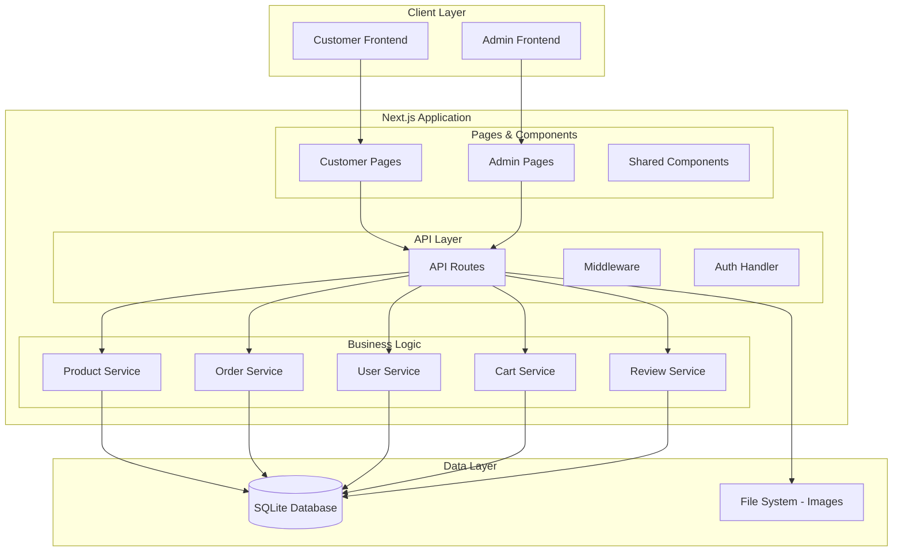

# Design Document

## Overview

The Mock Shop is a comprehensive e-commerce application built with Next.js 15 using the App Router, TypeScript, Prisma ORM, and SQLite database. The application provides both customer-facing shopping functionality and administrative management interfaces, supporting guest checkout, user accounts, product catalog management, order processing, inventory tracking, reviews, discount codes, and analytics.

The system implements a clean separation between presentation, business logic, and data layers, utilizing Next.js 15's latest features, Prisma for type-safe database operations, and shadcn/ui for consistent, accessible UI components. The design prioritizes responsive user experience, data integrity, and secure payment processing while maintaining scalability for future enhancements.

## Architecture

### High-Level Architecture



### Technology Stack

- **Frontend Framework**: Next.js 15 with App Router
- **Language**: TypeScript
- **Database**: SQLite with Prisma ORM
- **UI Components**: shadcn/ui
- **Styling**: Tailwind CSS 4
- **Authentication**: NextAuth.js v5 (Auth.js)
- **State Management**: React Context + useReducer for cart state, Zustand for complex state
- **Form Handling**: React Hook Form with Zod validation
- **Image Handling**: Next.js Image component with local file storage
- **Email**: Resend or Nodemailer for order notifications
- **Payment Processing**: Simulated payment gateway for demonstration
- **Search**: Client-side filtering and search functionality

## Components and Interfaces

### Prisma Schema Models

```prisma
// User Model
model User {
  id        String   @id @default(cuid())
  email     String   @unique
  password  String
  firstName String
  lastName  String
  role      Role     @default(CUSTOMER)
  createdAt DateTime @default(now())
  updatedAt DateTime @updatedAt

  orders    Order[]
  reviews   Review[]
  cart      Cart?
  wishlist  Wishlist[]

  @@map("users")
}

enum Role {
  CUSTOMER
  ADMIN
}

// Product Model
model Product {
  id            String   @id @default(cuid())
  name          String
  description   String?
  price         Decimal  @db.Decimal(10, 2)
  categoryId    String?
  stockQuantity Int      @default(0)
  images        String[] // Array of image paths
  isActive      Boolean  @default(true)
  createdAt     DateTime @default(now())
  updatedAt     DateTime @updatedAt

  category   Category?   @relation(fields: [categoryId], references: [id])
  orderItems OrderItem[]
  cartItems  CartItem[]
  reviews    Review[]
  wishlist   Wishlist[]

  @@map("products")
}

// Category Model
model Category {
  id          String  @id @default(cuid())
  name        String
  description String?
  parentId    String?
  slug        String  @unique
  isActive    Boolean @default(true)

  parent   Category?  @relation("CategoryHierarchy", fields: [parentId], references: [id])
  children Category[] @relation("CategoryHierarchy")
  products Product[]

  @@map("categories")
}

// Order Model
model Order {
  id              String      @id @default(cuid())
  userId          String?
  status          OrderStatus @default(PENDING)
  subtotal        Decimal     @db.Decimal(10, 2)
  discountAmount  Decimal     @default(0) @db.Decimal(10, 2)
  total           Decimal     @db.Decimal(10, 2)
  shippingAddress Json
  billingAddress  Json
  paymentMethod   String
  discountCode    String?
  createdAt       DateTime    @default(now())
  updatedAt       DateTime    @updatedAt

  user  User?       @relation(fields: [userId], references: [id])
  items OrderItem[]

  @@map("orders")
}

enum OrderStatus {
  PENDING
  CONFIRMED
  SHIPPED
  DELIVERED
  CANCELLED
}

model OrderItem {
  id        String  @id @default(cuid())
  orderId   String
  productId String
  quantity  Int
  price     Decimal @db.Decimal(10, 2)

  order   Order   @relation(fields: [orderId], references: [id], onDelete: Cascade)
  product Product @relation(fields: [productId], references: [id])

  @@map("order_items")
}

// Cart Model
model Cart {
  id        String   @id @default(cuid())
  userId    String   @unique
  createdAt DateTime @default(now())
  updatedAt DateTime @updatedAt

  user  User       @relation(fields: [userId], references: [id], onDelete: Cascade)
  items CartItem[]

  @@map("carts")
}

model CartItem {
  id        String @id @default(cuid())
  cartId    String
  productId String
  quantity  Int

  cart    Cart    @relation(fields: [cartId], references: [id], onDelete: Cascade)
  product Product @relation(fields: [productId], references: [id])

  @@unique([cartId, productId])
  @@map("cart_items")
}

// Review Model
model Review {
  id         String   @id @default(cuid())
  productId  String
  userId     String
  rating     Int      @db.Int // 1-5
  comment    String?
  isApproved Boolean  @default(false)
  createdAt  DateTime @default(now())

  product Product @relation(fields: [productId], references: [id], onDelete: Cascade)
  user    User    @relation(fields: [userId], references: [id])

  @@unique([productId, userId])
  @@map("reviews")
}

// Discount Code Model
model DiscountCode {
  id             String          @id @default(cuid())
  code           String          @unique
  type           DiscountType
  value          Decimal         @db.Decimal(10, 2)
  minOrderAmount Decimal?        @db.Decimal(10, 2)
  maxUses        Int?
  currentUses    Int             @default(0)
  expiresAt      DateTime?
  isActive       Boolean         @default(true)
  createdAt      DateTime        @default(now())

  @@map("discount_codes")
}

enum DiscountType {
  PERCENTAGE
  FIXED
}

// Wishlist Model
model Wishlist {
  id        String   @id @default(cuid())
  userId    String
  productId String
  createdAt DateTime @default(now())

  user    User    @relation(fields: [userId], references: [id], onDelete: Cascade)
  product Product @relation(fields: [productId], references: [id], onDelete: Cascade)

  @@unique([userId, productId])
  @@map("wishlists")
}
```

### API Endpoints Structure

```
/api/
├── auth/
│   ├── login
│   ├── register
│   └── logout
├── products/
│   ├── GET / (list with filters)
│   ├── POST / (admin only)
│   ├── GET /[id]
│   ├── PUT /[id] (admin only)
│   └── DELETE /[id] (admin only)
├── categories/
│   ├── GET /
│   ├── POST / (admin only)
│   └── PUT /[id] (admin only)
├── cart/
│   ├── GET /
│   ├── POST /items
│   ├── PUT /items/[id]
│   └── DELETE /items/[id]
├── orders/
│   ├── GET / (user's orders or admin all)
│   ├── POST / (create order)
│   ├── GET /[id]
│   └── PUT /[id]/status (admin only)
├── reviews/
│   ├── GET /product/[productId]
│   ├── POST /
│   └── PUT /[id]/approve (admin only)
├── discounts/
│   ├── POST /validate
│   ├── GET / (admin only)
│   └── POST / (admin only)
├── wishlist/
│   ├── GET /
│   ├── POST /
│   └── DELETE /[id]
└── admin/
    ├── analytics/
    ├── customers/
    └── settings/
```

### Frontend Component Architecture

```
components/
├── ui/ (shadcn/ui components)
│   ├── button.tsx
│   ├── input.tsx
│   ├── dialog.tsx
│   ├── card.tsx
│   ├── badge.tsx
│   ├── table.tsx
│   ├── form.tsx
│   ├── select.tsx
│   ├── toast.tsx
│   └── loading-spinner.tsx
├── layout/
│   ├── header.tsx
│   ├── footer.tsx
│   ├── navigation.tsx
│   ├── sidebar.tsx
│   └── admin-layout.tsx
├── product/
│   ├── product-card.tsx
│   ├── product-grid.tsx
│   ├── product-details.tsx
│   ├── product-filters.tsx
│   └── product-search.tsx
├── cart/
│   ├── cart-item.tsx
│   ├── cart-summary.tsx
│   ├── cart-drawer.tsx
│   └── cart-icon.tsx
├── checkout/
│   ├── checkout-form.tsx
│   ├── payment-form.tsx
│   ├── shipping-form.tsx
│   └── order-summary.tsx
├── admin/
│   ├── product-manager.tsx
│   ├── order-manager.tsx
│   ├── customer-manager.tsx
│   ├── analytics-dashboard.tsx
│   └── discount-manager.tsx
├── forms/
│   ├── login-form.tsx
│   ├── register-form.tsx
│   ├── review-form.tsx
│   └── contact-form.tsx
└── providers/
    ├── cart-provider.tsx
    ├── auth-provider.tsx
    └── theme-provider.tsx
```

## Data Models

### Prisma Configuration

The database will be managed entirely through Prisma, which will handle:
- Schema migrations
- Type-safe database queries
- Relationship management
- Database seeding

### Key Prisma Features Used

1. **Type Safety**: All database operations are fully typed
2. **Relations**: Proper foreign key relationships with cascade deletes
3. **Enums**: Type-safe status and role enums
4. **Unique Constraints**: Preventing duplicate entries where needed
5. **Default Values**: Automatic timestamps and default statuses
6. **JSON Fields**: For flexible address and metadata storage

## Error Handling

### API Error Response Format

```typescript
interface ApiError {
  error: string;
  message: string;
  statusCode: number;
  details?: any;
}
```

### Error Handling Strategy

1. **Validation Errors**: Use Zod schemas for input validation with detailed error messages
2. **Database Errors**: Catch and transform database errors into user-friendly messages
3. **Authentication Errors**: Implement proper 401/403 responses with clear messaging
4. **Not Found Errors**: Return 404 with helpful suggestions
5. **Server Errors**: Log detailed errors server-side, return generic messages to clients

### Client-Side Error Handling

- Global error boundary for React components
- Toast notifications for user feedback
- Retry mechanisms for failed API calls
- Graceful degradation for non-critical features

## Testing Strategy

### Unit Testing
- **Models**: Test data validation and business logic
- **Services**: Test business logic and data transformations
- **Utilities**: Test helper functions and calculations
- **Components**: Test component rendering and user interactions

### Integration Testing
- **API Routes**: Test complete request/response cycles
- **Database Operations**: Test CRUD operations and data integrity
- **Authentication Flow**: Test login, registration, and session management

### End-to-End Testing
- **Customer Journey**: Test complete purchase flow from browsing to order completion
- **Admin Workflows**: Test product management, order processing, and analytics
- **Cross-browser Testing**: Ensure compatibility across different browsers and devices

### Testing Tools
- **Unit/Integration**: Jest + React Testing Library
- **E2E**: Playwright (recommended for Next.js 15)
- **Database**: Separate test database with Prisma
- **API Testing**: Supertest for API endpoint testing
- **Component Testing**: Storybook for shadcn/ui components

### Key Design Decisions and Rationales

1. **SQLite Database Choice**
   - **Decision**: Use SQLite for data persistence
   - **Rationale**: Provides a lightweight, serverless database solution perfect for a mock shop demonstration while maintaining full SQL capabilities and ACID compliance

2. **Guest Checkout Support**
   - **Decision**: Allow purchases without user registration
   - **Rationale**: Reduces friction in the purchase process and accommodates users who prefer not to create accounts, increasing conversion rates

3. **Simulated Payment Processing**
   - **Decision**: Implement mock payment gateway instead of real payment integration
   - **Rationale**: Demonstrates payment flow without requiring actual payment processor setup, making the application easier to deploy and test

4. **Client-Side Search and Filtering**
   - **Decision**: Implement search functionality on the frontend
   - **Rationale**: Provides instant feedback and reduces server load for a small to medium product catalog, improving user experience

5. **Hierarchical Category System**
   - **Decision**: Support nested product categories
   - **Rationale**: Enables flexible product organization and intuitive navigation for customers browsing the catalog

6. **Review Moderation System**
   - **Decision**: Require admin approval for product reviews
   - **Rationale**: Ensures quality control and prevents inappropriate content while maintaining authentic customer feedback

### Performance Considerations

1. **Database Optimization**
   - Proper indexing on frequently queried columns (product name, category, price)
   - Connection pooling for concurrent requests
   - Query optimization for complex filters and search operations

2. **Caching Strategy**
   - Next.js static generation for product pages
   - API response caching for product catalogs
   - Image optimization with Next.js Image component
   - Session-based cart persistence for registered users

3. **Code Splitting**
   - Route-based code splitting with Next.js
   - Dynamic imports for heavy components (admin dashboard, analytics)
   - Separate admin bundle from customer bundle

4. **SEO Optimization**
   - Server-side rendering for product pages
   - Proper meta tags and structured data for products
   - Sitemap generation for search engines
   - Category-based URL structure for better indexing